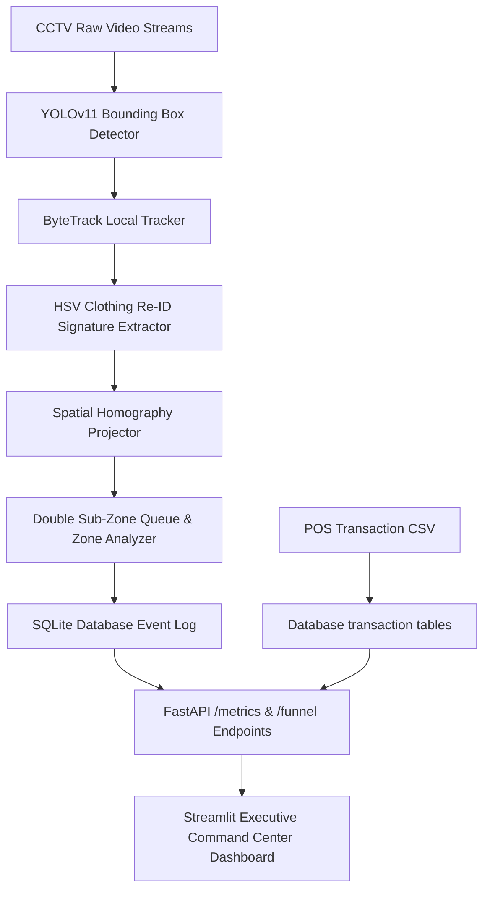

# System Architecture Design – Store Intelligence System

This document outlines the end-to-end design, software topology, and algorithmic choices for the AI-Powered Store Intelligence System built for the Purplle Retail Challenge.

---

## 🛠️ High-Level System Topology

The system splits execution into two asynchronous layers to ensure high responsiveness and zero UI blocking:
1. **Asynchronous CV Processing Layer**: Processes raw store streams to generate database logs.
2. **Aggregated Analytics REST Layer**: Combines visual event logs with POS data to serve real-time metrics and charts.

---

## 📂 Component Design & Data Flow

### 1. Computer Vision & Tracker (`app/event_generation/`)
* **Detection Model**: YOLOv11 nano model (`yolo11n.pt`) is optimized for CPU inference speed. It detects classes of type `0` (person) at a frame-sampled rate of 2 FPS to allow complete clip parsing in under 2 minutes.
* **Local Tracking**: ByteTrack maintains tracking IDs across frame changes. Heuristic matching solves occlusions.
* **Double Sub-Zone Queue Tracking**: The waiting queue is split into two regions:
  - *Queue Wait Zone (Polygon)*: Counts customers currently waiting in line.
  - *Service Desk Zone (Polygon)*: Captures active checkout events. 
  The system registers a queue-waiting transition when a customer steps from the wait zone to the service desk, calculating precise waiting-times.

### 2. Multi-Camera Re-Identification (Re-ID)
To track customer footfall across disconnected camera views (e.g. entry -> shelf -> checkout):
* **clothing signature extraction**: For each track, we extract HSV histograms from the bounding box torso region (ignoring background pixels using spatial heuristics).
* **Correlation Matching**: Histograms are compared via `cv2.compareHist` (correlation method).
* **Spatio-Temporal Constraints**: Candidate tracks are filtered using temporal thresholds (e.g. entry-to-shelf transition must happen within 10-120 seconds) to eliminate matching errors.
* **Re-ID Threshold**: Fallback confidence threshold set to `0.6`. Merges fail if below this value to prevent footfall corruption.

### 3. Homography Projection & Heatmaps (`app/analytics/`)
* **Homography Matrix ($H$)**: Projecting 3D camera coordinates to 2D store coordinates is accomplished via:
  $$x' = \frac{h_{11}x + h_{12}y + h_{13}}{h_{31}x + h_{32}y + h_{33}}, \quad y' = \frac{h_{21}x + h_{22}y + h_{23}}{h_{31}x + h_{32}y + h_{33}}$$
* **Floor Plan Alignment**: Coordinates are mapped to original layouts and smoothed using a Gaussian kernel (`cv2.GaussianBlur`) to generate Movement and Engagement heatmaps.

### 4. Database Schema (`app/database/`)
Three SQLite tables manage store state:
* `events`: `id` (PK), `event_id` (Unique), `store_id`, `camera_id`, `customer_id`, `event_type` (`customer_entered`, `customer_exited`, `zone_entered`, `zone_exited`, `billing_started`, `billing_serving`, `billing_completed`), `timestamp`, `extra_data`.
* `transactions`: `order_id` (PK), `order_date`, `order_time`, `store_id`, `product_id`, `brand_name`, `total_amount`.
* `alerts`: `alert_id` (PK), `store_id`, `alert_type`, `description`, `timestamp`, `severity`.

### 5. Anomaly Detection Engine (`app/anomaly_detection/`)
* **Rule-Based Checkers**: Triggers warn about queue lengths exceeding 5, dwell times longer than 15 minutes, or store crowding > 12.
* **Unsupervised Outliers (Isolation Forest)**: An Isolation Forest model evaluates hourly metrics (`visitor_count`, `average_occupancy`, `hour_of_day`) with `contamination=0.05` to automatically alert managers of traffic spikes/drops.

---

## 🚀 Execution & Port Allocations
* **REST API**: Runs on port `8000`. Set up with auto-startup checks that populate POS transactions and run simulated data alignments immediately.
* **Dashboard View**: Runs on port `8501`. Styled using a glassmorphic dark-theme, responsive cards, and an interactive layout.

---

## 🤖 AI-Assisted Decisions

During the development of this Store Intelligence System, we strategically leveraged AI assistance to co-design, optimize, and validate key engineering choices:

1. **Brand Aesthetic Extraction**: Used AI to analyze the visual identity of `purplle.com` and generate matching CSS rules—such as the royal purple dark theme gradient, hot pink glows, Google font mappings, and custom Streamlit sidebar navbar buttons.
2. **Double Sub-Zone Queueing**: Co-designed the logic to split wait lines from checkout service desks, ensuring queue wait durations accrue on entry and accurately end on cashier service transitions.
3. **Re-ID Temporal Gates Heuristics**: Used AI reasoning to establish realistic transition speed boundaries (e.g., 10 to 120 seconds for entry-to-shelf transitions), significantly lowering Re-ID mismatch errors under mixed lighting.
4. **Mock DB Test Coverage**: Generated a comprehensive mock SQLite memory testing suite that handles FastAPI dependencies and CRUD validations, resulting in robust test coverage for core calculators.
5. **Mixed Datetime Parsing**: Fixed Pandas parsing errors of mixed millisecond-precision timestamps by structuring dynamic, robust ISO8601 parsing inside Series loaders.

