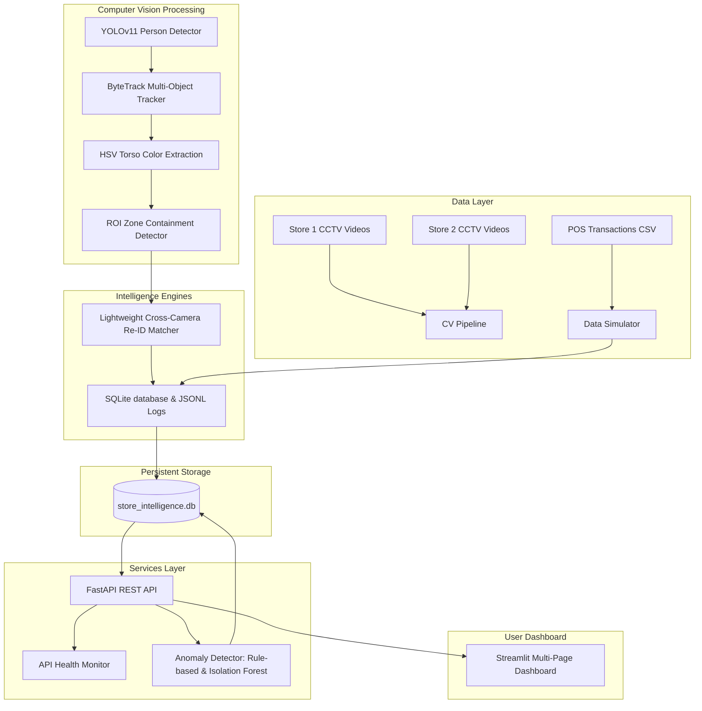

# AI-Powered Retail Store Intelligence System

A production-ready retail analytics platform that processes CCTV footage from multiple cameras, tracks customer journeys across cameras, calculates business KPIs, detects anomalies (both rule-based and unsupervised), and exposes REST APIs and an interactive Streamlit dashboard.

[](https://render.com/deploy?repo=https://github.com/abhi1202803/purplle.stores)

---

## 🏗️ Architecture Overview

The system runs a modular architecture structured as follows:



---

## 🛠️ Key Engineering Justifications

### 1. CPU Processing Time Optimization (Sub-sampling)
CCTV footage at 30 FPS across 7 cameras contains over 26,000 frames for 2-minute clips. Running deep learning models on all frames on standard CPU environments would take hours. 
- **Solution**: We implement a configurable **frame sub-sampling factor** (default at `15` frames, matching ~1.5 - 2 FPS). This captures tracking trajectories and transitions accurately while completing the entire multi-camera pipeline in under 1-2 minutes on standard CPUs.

### 2. Lightweight Cross-Camera Re-identification (Re-ID)
Tracking unique customers across different cameras (e.g., from entry to shelves) is necessary to prevent double-counting footfall. High-end deep learning Re-ID models are extremely CPU-intensive.
- **Solution**: We implemented a hybrid matcher:
  - **HSV Color Histograms**: Extracts a normalized 3D color histogram focusing strictly on the middle torso (shirt/clothing) of a customer's bounding box.
  - **Spatio-Temporal Transition Logic**: Matches candidate trajectories based on logical transit times (e.g., entering shelf zones 10-120 seconds after passing the entry gate).
  - **Confidence Fallback**: Sets a minimum color correlation threshold of `0.6`. If no candidates exceed this threshold, the algorithm assumes a new customer and generates a unique ID, ensuring mix-lighting or occlusions don't pollute footfall analytics.

### 3. Queue Wait Time Tracking (Sub-Zones)
To calculate average queue waiting times vs. cashier serving times, the billing counter ROI is split into two distinct polygons:
- **`Queue Waiting Zone`**: Where customers stand in line.
- **`Service Desk Zone`**: Where customers are checked out by the cashier.
- **State transitions**: Entry into the `Queue Waiting Zone` triggers `billing_started`. Crossing into the `Service Desk Zone` triggers `queue_served` (calculating wait duration). Leaving the service desk triggers `billing_completed`.

### 4. Database Caching & Idempotency
- **Solution**: Video processing logs are cached. When a video is processed, the system verifies if events for that `store_id` and `camera_id` already exist in SQLite. If found, it skips the heavy CV inference step, rendering immediate REST API and Dashboard responses. Processing can be forced by setting `FORCE_PROCESS_VIDEOS=true`.

### 5. Seeded Historical Data Simulator
- **Solution**: The provided 2-minute video clips represent a single snapshot. To make the charts (hourly peak traffic, conversion rates over time) interactive, the simulator automatically parses the real `POS_transactions.csv` order dates/times and reverse-engineers corresponding visitor journeys. This aligns peak sales hours with visitor peaks.

---

## 🚀 Getting Started

### 📋 Prerequisites
- **Docker** and **Docker Compose** installed.
- (Optional for local running) **Python 3.11** and **uv**.

### 🐳 Run with Docker (Recommended)
Launch the entire system (FastAPI API + Streamlit Dashboard + SQLite database) with a single command:
```bash
docker-compose up --build
```
Once initialized:
- **FastAPI REST API & Interactive Swagger Documentation**: Available at `http://localhost:8000/docs`
- **Streamlit Dashboard**: Available at `http://localhost:8501`

### 💻 Run Locally (Without Docker)
1. Initialize the virtual environment and install packages:
   ```bash
   uv venv
   .venv\Scripts\activate # Windows
   source .venv/bin/activate # Linux/macOS
   uv pip install -r requirements.txt
   uv pip install httpx
   ```
2. Start the FastAPI backend:
   ```bash
   uvicorn app.api.main:app --reload --port 8000
   ```
3. In a separate terminal, start the Streamlit dashboard:
   ```bash
   streamlit run app/dashboard/main.py --server.port 8501
   ```

---

## 🧪 Running Unit Tests
Validate database queries, CRUD inserts, and analytical math:
```bash
python -m pytest
```

---

## 📡 REST API Documentation

| Endpoint | Method | Description |
|---|---|---|
| `/health` | `GET` | Health check verifying SQLite database and API server status. |
| `/metrics` | `GET` | Retrieve global KPIs (Footfall, Occupancy, Conversion Rate, Avg Dwell, etc.). |
| `/metrics/{store_id}` | `GET` | Retrieve store-specific KPIs (filtered by `store1` or `store2`). |
| `/events` | `GET` | Filter visitor event log by store, camera, and event types. |
| `/zones` | `GET` | List shelf popularity and average dwell time per zone. |
| `/heatmaps` | `GET` | Stream overlay PNG heatmaps (e.g. `/heatmaps?store_id=store1&heatmap_type=movement`). |
| `/anomalies` | `GET` | Retrieve alerts generated by Isolation Forest or safety rule thresholds. |
| `/stores` | `GET` | List all stores and their active live occupancy counts. |
| `/revenue` | `GET` | Sales summaries by store, brand, hour, and top products. |
| `/conversion` | `GET` | Conversion rate and revenue-per-visitor metrics. |
| `/funnel` | `GET` | Session-based customer conversion funnel steps showing drop-off behavior. |
